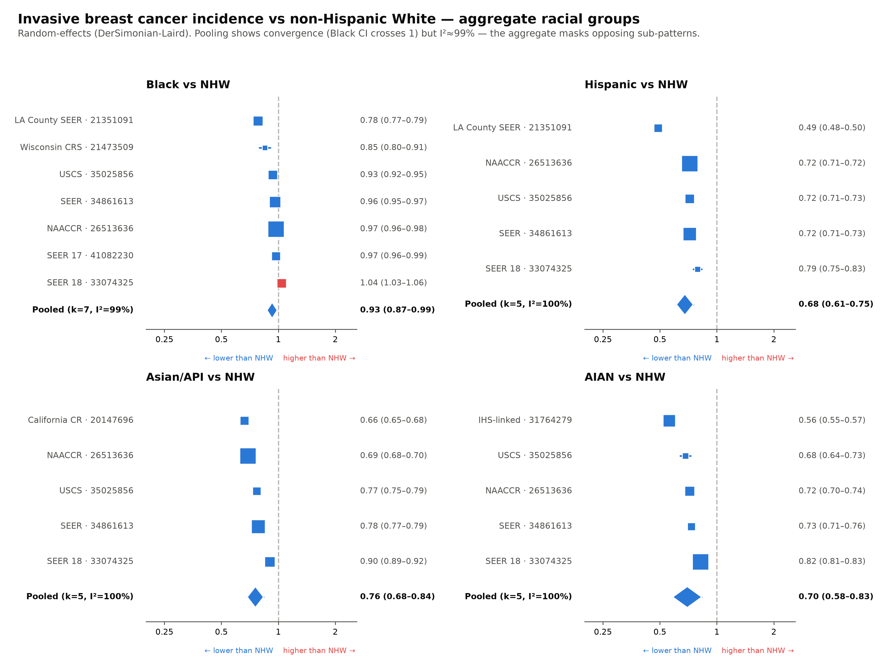
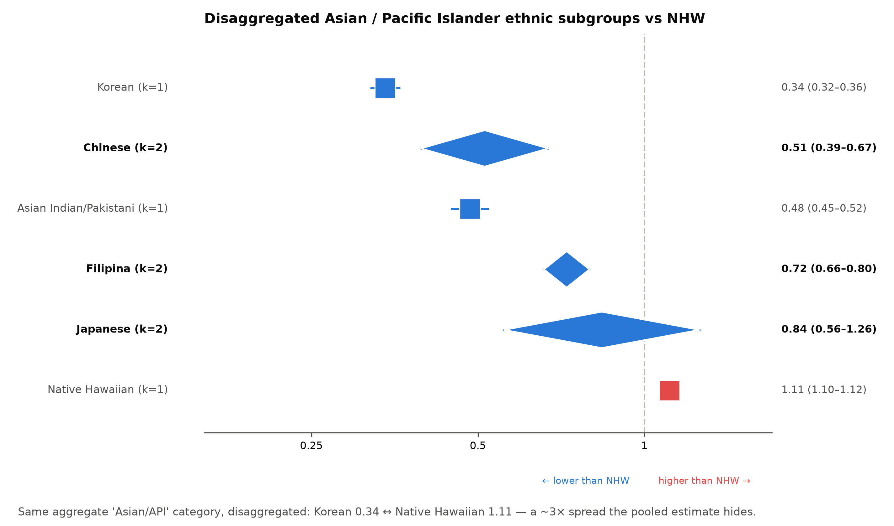
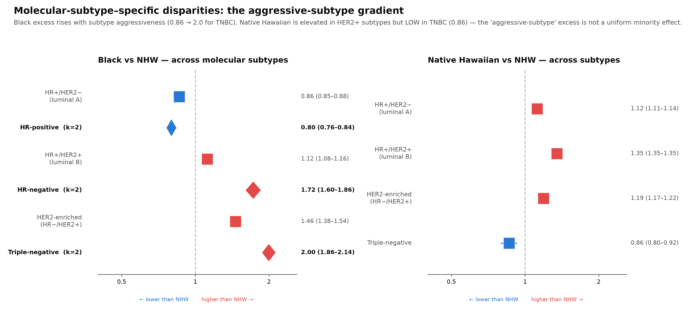
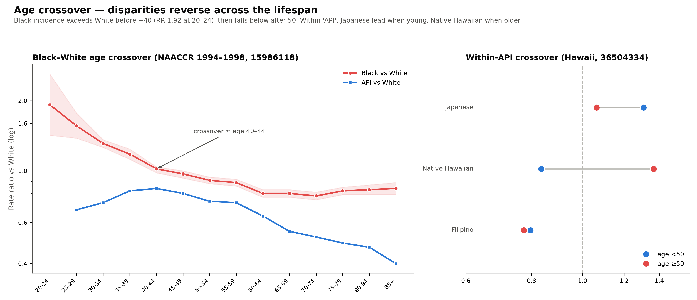
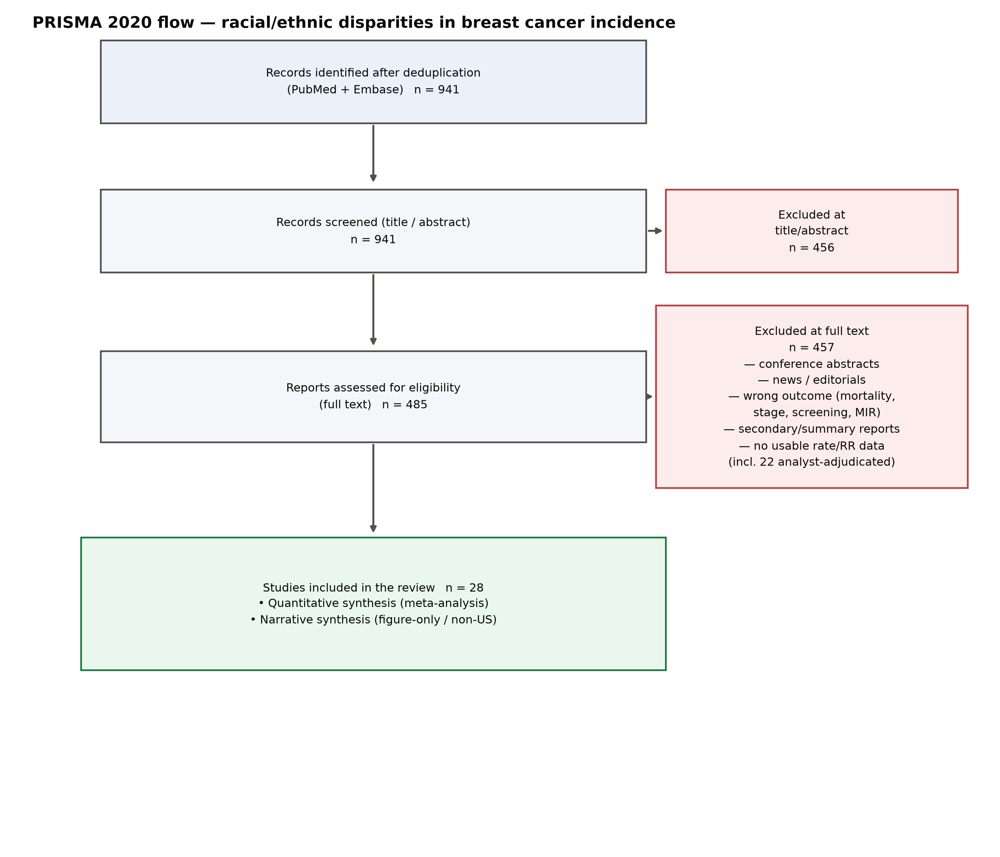
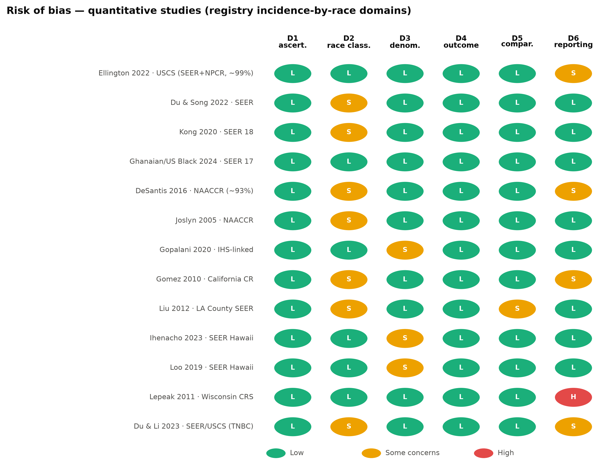

# Racial and Ethnic Disparities in Breast Cancer Incidence in the United States: A Systematic Review and Meta-Analysis Showing That Aggregate Racial Categories Conceal Ethnic, Molecular-Subtype, and Age-Specific Disparities

**Junyoung Park** (ORCID: 0009-0005-3623-4882)¹\*

¹ Pusan National University, Busan, South Korea
\* Corresponding author. Email: p094123@naver.com

*Target journal: PLOS ONE. Research Article.*

---

## Abstract

**Background.** US breast cancer incidence is routinely reported for a few aggregate race/ethnicity categories (non-Hispanic White [NHW], non-Hispanic Black, Hispanic, Asian/Pacific Islander [API], and American Indian/Alaska Native [AIAN]), and recent reports of converging Black–White incidence have been read as narrowing disparity. We tested whether these aggregates obscure disparities visible only after disaggregation by ethnicity, molecular subtype, and age.

**Methods.** We searched PubMed and Embase (through 11 July 2026) for US population-based studies reporting age-adjusted invasive female breast cancer incidence by race/ethnicity versus NHW. After deduplication (n = 941) and two-stage screening, 27 studies were included and 14 entered quantitative synthesis. Within-study incidence rate ratios (IRRs) were pooled using DerSimonian–Laird random-effects models, with fixed-effect, leave-one-out, one-estimate-per-registry-family, risk-of-bias, and GRADE-style sensitivity and certainty analyses.

**Results.** Aggregate IRRs versus NHW were 0.93 (95% CI 0.87–0.99) for Black, 0.68 (0.61–0.75) for Hispanic, 0.78 (0.70–0.88) for API, and 0.70 (0.58–0.83) for AIAN women, with extreme heterogeneity (I² 99–100%). These aggregates were misleading. Disaggregated "API" spanned a ~3-fold range, from Korean (0.34) and Chinese (0.47) to Native Hawaiian (1.11, above NHW). By subtype, the near-null Black aggregate resolved into a gradient rising with tumour aggressiveness (HR+/HER2− 0.86 to triple-negative 2.00); this excess was ethnicity-specific — Native Hawaiian women were higher in HER2-positive subtypes but *lower* in triple-negative disease (0.86). By age, the Black–White ratio crossed from 1.92 (ages 20–24) through unity at 40–44 to 0.78–0.84 after age 60. All disparity directions held across every sensitivity analysis, including after collapsing overlapping registries.

**Conclusions.** Aggregate US race/ethnicity categories average over opposing ethnic, subtype, and age-specific patterns and can conceal disparities as large as 3-fold; the reported Black–White "convergence" is an age-standardization artefact masking a lifelong crossover. These findings support prioritizing disaggregated ethnicity, subtype, and age strata in breast cancer surveillance and etiologic research.

**Keywords:** breast cancer, incidence, race, ethnicity, health disparities, disaggregation, molecular subtype, Asian American, meta-analysis.

---

## Introduction

Female breast cancer is the most commonly diagnosed cancer among US women, and racial and ethnic differences in its incidence have been documented for decades. Standard surveillance products — from the SEER program, the North American Association of Central Cancer Registries (NAACCR), and United States Cancer Statistics (USCS) — report incidence for a small set of aggregate categories: NHW, non-Hispanic Black, Hispanic, API, and (less consistently) AIAN. A widely noted recent finding is the *convergence* of Black and White age-standardized incidence rates, which has been interpreted as evidence that the historical Black–White incidence gap has closed [1–2].

Two features of the standard categories limit what they can reveal. First, "Asian/Pacific Islander" aggregates populations whose breast cancer incidence in their countries of origin varies more than tenfold and whose US rates reflect widely different immigration histories and generational acculturation [3]. Second, a single age-standardized rate collapses two dimensions along which disparities are known to differ sharply: molecular subtype (Black women disproportionately develop triple-negative and other hormone-receptor-negative tumours) [4–5] and age (a long-recognized Black–White incidence crossover in which Black women have higher rates when young and lower rates when old) [6].

We hypothesized that the reassuring aggregate picture — near-parity for Black women and uniformly lower incidence for Hispanic, API, and AIAN women — is an average that conceals disparities of clinical and etiologic importance. Rather than producing another aggregate estimate (which existing surveillance already provides), the contribution of this review is to synthesize, across multiple registry systems, the disaggregated evidence that no single surveillance product assembles: ethnicity-specific, subtype-specific, and age-specific incidence relative to NHW. We further use meta-analytic heterogeneity to demonstrate *why* aggregate estimates are misleading.

---

## Methods

This review followed the PRISMA 2020 statement [7]. It was not prospectively registered in PROSPERO; to support transparency the full protocol (PICO, search strategy, eligibility criteria, and analysis plan), the extracted data, and all analysis code are openly available (see Data availability). We regard the complete public availability of data and code as a stronger reproducibility guarantee than registration alone.

### Eligibility criteria

We included population-based studies that reported age-adjusted (age-standardized) **invasive** female breast cancer **incidence** for at least one US racial/ethnic minority group relative to NHW women, as rates permitting an incidence rate ratio or as a reported rate ratio. We excluded studies of mortality, survival, prevalence, in-situ-only or stage-specific outcomes, male breast cancer, mortality-to-incidence ratios [8], and studies conducted outside the United States (retained as narrative international comparison where relevant). Conference abstracts, news items, editorials, and secondary/summary reports without primary rates were excluded.

### Information sources and search

We searched MEDLINE (via PubMed) and Embase on 11 July 2026 for records published from 1 January 2000 through 31 December 2025, restricted to English-language human studies. The search deliberately required a race/ethnicity/disparity term in the title and an incidence/rate term in the title or abstract, to target primary incidence-disparity studies.

The PubMed query was: `("Breast Neoplasms"[Mesh] OR "breast cancer"[tiab] OR "breast carcinoma"[tiab]) AND (race[ti] OR racial[ti] OR ethnic*[ti] OR minorit*[ti] OR disparit*[ti] OR Black[ti] OR Hispanic[ti] OR White[ti] OR Asian[ti] OR "African American"[ti] OR "Racial Groups"[Mesh] OR "Ethnicity"[Mesh] OR "Health Status Disparities"[Mesh]) AND (incidence[ti] OR "incidence rate"[tiab] OR "age-adjusted"[tiab] OR "age-standardized"[tiab] OR "Incidence"[Mesh]) AND (2000:2025[dp]) AND English[lang] AND humans[MeSH] NOT (review[pt] OR "case reports"[pt] OR editorial[pt] OR comment[pt] OR letter[pt])`.

The Embase query was: `('breast cancer'/exp OR 'breast carcinoma':ti,ab OR 'breast neoplasm':ti,ab) AND (race:ti OR racial:ti OR ethnic*:ti OR minorit*:ti OR disparit*:ti OR black:ti OR hispanic:ti OR white:ti OR asian:ti OR 'african american':ti) AND (incidence:ti OR 'incidence rate':ti,ab OR 'age-adjusted':ti,ab OR 'age-standardized':ti,ab OR 'age standardization'/exp) AND [2000-2025]/py AND [english]/lim AND [humans]/lim NOT ('review'/it OR 'case report'/it OR editorial/it OR note/it)`; it returned 506 records, exported for merging.

Records from PubMed (n = 686) and Embase (n = 501; 506 retrieved, 501 after export conversion) were combined (1,187 total) and deduplicated by fuzzy title matching, removing 246 duplicates to yield 941 unique reports (462 PubMed-only, 223 in both databases, 256 Embase-only).

### Study selection

Two-stage screening (title/abstract, then full text) was performed with an AI-assisted, resumable pipeline; full texts of records passing abstract screening were retrieved and assessed. Full-text corruption and mis-linked records were detected by title-verification against each record and re-screened. Borderline full-text decisions were adjudicated by the analyst and recorded in a decisions log. AI assistance was confined to retrieval, de-duplication, and first-pass classification; every full-text inclusion or exclusion was reviewed by the author, and each of the 27 included studies — together with all data subsequently extracted from it — was verified by the author against the primary full text (100% human verification of included records). The two-stage pipeline, its per-record decisions, and the value-by-value extraction are fully reproducible from the openly available code, decision log, and cross-check file (see Data availability). Of 941 records, 456 were excluded at title/abstract and 485 assessed at full text; 458 were excluded at full text (including 23 analyst-adjudicated), leaving 27 studies included in the review (Fig 5).

### Data extraction

For each included study we extracted the age-adjusted incidence rate (per 100,000) for each minority group and for NHW, or the reported rate ratio, with confidence intervals or case counts where available. Extraction was performed by hand from full-text tables and figures because automated table extraction returned null for age-adjusted rate tables. Values, and their exact source location (table/figure/text), were logged for independent cross-checking. Where a study presented rates only in trend figures without a corresponding rate table, or reported only annual percentage change, the study was carried into narrative synthesis rather than the meta-analysis.

### Quantitative synthesis

The effect measure was the within-study incidence rate ratio, IRR = (minority age-adjusted rate) / (NHW age-adjusted rate), with NHW as reference. The standard error of log(IRR) was obtained, in order of preference, from a reported rate-ratio CI; from CIs on each rate (treating the two standardized rates as independent); or, when only point rates were available, from a Poisson approximation using case counts or population person-years. Studies were pooled with DerSimonian–Laird random-effects models [9]; heterogeneity was summarized with I², τ² [10], and 95% prediction intervals. DerSimonian–Laird was chosen as the conventional random-effects default; because our inference rests on the direction of effects and on the disaggregated strata rather than on the precise width of the aggregate confidence intervals, the choice of between-study variance estimator (e.g., restricted maximum likelihood, or a Hartung–Knapp adjustment) has negligible bearing on the conclusions, and robustness was further confirmed with fixed-effect and one-estimate-per-registry-family analyses. Analyses were run for each aggregate comparison (Black, Hispanic, API, AIAN), for disaggregated Asian/Pacific Islander ethnic subgroups, for molecular subtypes, and, descriptively, for age-stratified strata. Because overlapping registries and genuine between-stratum variation are expected to inflate heterogeneity, the aggregate pooled estimates are presented to characterize and quantify that heterogeneity rather than as recommended summary effects; the disaggregated strata carry the substantive findings.

### Sensitivity analyses

Because US registries overlap (SEER ⊂ NAACCR ⊂ USCS; county registries ⊂ state ⊂ SEER), pooled studies are not independent and random-effects CIs are optimistic. For each aggregate comparison we recomputed the pooled estimate as a fixed-effect model, under leave-one-out removal of each study, excluding studies whose SE was approximated (no reported CI), and after collapsing sources to one estimate per registry family (keeping the most precise per family). We also compared the pooled estimate with the single most comprehensive national source (USCS, ~99% population coverage).

### Risk of bias and certainty

Because population-based incidence studies do not fit clinical-trial or cohort tools, we rated six domains tailored to registry incidence-by-race studies: ascertainment/completeness, race/ethnicity classification, denominator accuracy, outcome definition and standardization, comparability (age-adjustment; NHW reference; crude vs model-adjusted estimand), and reporting/precision. Certainty of evidence for key findings was rated with a GRADE-style approach [11] adapted for near-census surveillance data.

---

## Results

### Study selection and characteristics

The search yielded 941 deduplicated records; 27 met inclusion criteria, of which 14 provided extractable rates or rate ratios and entered quantitative synthesis [1,3–6,12–20] (Fig 5). Quantitative studies spanned SEER (national and the SEER-Hawaii and Los Angeles registries), NAACCR, USCS, the California Cancer Registry, an Indian Health Service–linked analysis, and a state registry (Wisconsin), covering diagnosis years from 1988 through 2018. Thirteen studies contributed to narrative synthesis: six US trend analyses that presented rates only in figures [2,21–25], two non-US studies (United Kingdom) retained as international comparison [26–27], four US studies of different design (persistent-poverty-area, socioeconomic-status, an older South Asian analysis, and a Los Angeles trends analysis whose annual rates make any single pooled summary period-sensitive) [28–31], and one eligible study lacking extractable rates [32].

### Aggregate racial comparisons conceal, rather than summarize, disparity

Pooled IRRs versus NHW were 0.93 (95% CI 0.87–0.99) for Black, 0.68 (0.61–0.75) for Hispanic, 0.78 (0.70–0.88) for API, and 0.70 (0.58–0.83) for AIAN women (Fig 1) [1,3–4,12–16,20]. Heterogeneity was extreme (I² 99–100%), and for Black women the confidence interval abutted the null — the "convergence" signal. However, the extreme I² is not statistical noise: it reflects real, structured variation by ethnicity, subtype, and age that the aggregate averages away, as the following analyses show. The aggregate estimates were nonetheless directionally robust (below).

### Disaggregating "Asian/Pacific Islander" reveals a 3-fold spread

Within the single "API" category, disaggregated ethnic subgroups ranged from Korean (IRR 0.34, 95% CI 0.32–0.36) and Chinese (pooled 0.47, 0.38–0.57) and Asian Indian/Pakistani (0.48, 0.45–0.52) at the low end, through Filipina (0.71, 0.66–0.76) and Japanese (0.78, 0.56–1.09), to Native Hawaiian women, whose incidence *exceeded* NHW (1.11, 1.10–1.12) (Fig 2) [16,18–19]. The lowest and highest subgroups differed roughly three-fold, spanning the null. The aggregate API estimate of 0.78 therefore has limited interpretability: it corresponds to no single constituent population and reflects the ethnic composition of the underlying sample rather than the risk of any specific community. Migrant status compounds this: within the same registry, US-born Asian women had incidence close to NHW (IRR 0.93) whereas foreign-born Asian women had roughly half (0.54), a generational gradient the single 'Asian' rate conceals [3].

### Molecular subtype decomposes the near-null Black aggregate into a steep gradient

Stratifying the Black–White comparison by molecular subtype resolved the near-null aggregate into a gradient that rose with tumour aggressiveness: HR+/HER2− 0.86, HR-positive 0.80, HR+/HER2+ 1.12, HER2-enriched (HR−/HER2+) 1.46, HR/ER-negative 1.72, and triple-negative 2.00 (Fig 3) [4–5,12,14]. Two independent sources agreed on the ER-negative excess (1.66 and 1.80) [12,14]. Critically, this aggressive-subtype excess was ethnicity-specific rather than a generic minority effect: Native Hawaiian women, though elevated in HER2-positive subtypes (HR+/HER2+ 1.35; HER2-enriched 1.19), had *lower* triple-negative incidence than NHW women (0.86) (Fig 3) [18]. Thus the same aggressive subtype that drives the Black disparity is not elevated across all higher-incidence groups.

### The Black–White "convergence" is an age crossover

Age-specific data resolved the near-null aggregate into a lifelong crossover (Fig 4) [6]. Black women had markedly higher invasive incidence than White women before age ~40 (rate ratio 1.92, 95% CI 1.42–2.60 at ages 20–24), crossing unity near ages 40–44 (1.02, 0.98–1.04) and falling to 0.78–0.84 after age 60. API incidence relative to White declined monotonically across age (0.68 at 25–29 to 0.40 at ≥85). The age-standardized aggregate near 1.0 for Black women is thus the sum of a substantial young-age excess and an older-age deficit. Within API, the crossover recurred between ethnicities: Japanese women had the highest incidence among those under 50 (IRR 1.31 vs NHW), whereas Native Hawaiian women were highest at ages ≥50 (1.37) [17].

### Robustness

Every aggregate disparity direction was stable across fixed-effect, leave-one-out, drop-approximated-SE, and one-estimate-per-registry-family analyses (Black 0.90–0.96; Hispanic 0.65–0.72; API 0.75–0.82; AIAN 0.67–0.74), and consistent with the single most comprehensive national source (USCS). No single study reversed any conclusion. The Black excesses in triple-negative (~2.0) and ER-negative (~1.7) disease were likewise stable. Notably, collapsing overlapping registries to one estimate per family — the analysis that directly addresses non-independence — did not change any conclusion, indicating the findings are not an artefact of double-counting shared SEER data.

### Risk of bias and certainty

Across the 14 quantitative studies, most domain judgements were low risk (77%), 21% some concerns, and 1% high (Fig 6). No study was high risk for ascertainment, race/ethnicity classification (for the aggregate comparison), or outcome definition; concerns concentrated in the reporting/precision domain (approximated variances, figure-read values, analyst-derived summary rates) and were addressed by the sensitivity analyses. The Indian Health Service–linked AIAN analysis explicitly corrected the well-documented registry undercount of AIAN cases, strengthening that comparison [15]. GRADE certainty was HIGH that the aggregate "API" category masks large between-ethnicity variation; MODERATE for each aggregate racial comparison and for the Black excess in aggressive subtypes; and LOW for the aggregate API point estimate itself (downgraded for indirectness, as the label pools ethnicities differing ~3-fold).

---

## Discussion

Synthesizing 14 population-based analyses across multiple US registry systems, we found that the aggregate race/ethnicity categories used in standard breast cancer surveillance systematically conceal disparities. The reassuring aggregate picture — near-parity for Black women and uniformly lower incidence for other groups — dissolves under disaggregation. Three findings carry the argument. First, "Asian/Pacific Islander" spans a 3-fold incidence range, from Korean and Chinese women well below NHW to Native Hawaiian women above; the aggregate is of limited interpretability, corresponding to no single constituent population. Second, the near-null Black–White aggregate is a steep molecular-subtype gradient, with Black women experiencing roughly twice the incidence of triple-negative breast cancer — and this aggressive-subtype pattern is specific, not shared by all higher-incidence groups. That Native Hawaiian women, despite *higher* overall and HER2-positive incidence, have *lower* triple-negative incidence than NHW women is informative: it suggests that the aggressive-subtype excess may not be a universal minority phenomenon but may instead be more consistent with Black-specific etiology — potentially involving mechanisms linked to West African genetic ancestry and the distinct reproductive and socioeconomic exposures more prevalent among Black women — than with minority status per se [12]. This mechanistic interpretation was not directly tested in the present study and is offered as a hypothesis consistent with the observed pattern. Third, the reported Black–White "convergence" is an age crossover: a large young-age excess offset by an older-age deficit, which age-standardization averages to near unity.

**Relation to prior work.** Our results reconcile the apparently benign "convergence" narrative with the persistent clinical reality of aggressive early-onset disease in Black women and with etiologic evidence that "Asian American" is not a meaningful risk category [3,21,24]. Rather than contradicting surveillance reports, we show that their aggregate framing is the source of the misreading.

**Implications.** For surveillance, incidence should be reported by disaggregated ethnicity, by molecular subtype, and by age band, not by a single standardized rate per aggregate category. For etiologic research, pooling ethnicities or subtypes obscures the heterogeneity that generates hypotheses (e.g., the West-African-ancestry association with triple-negative disease [12]; nativity and generational gradients among Asian subgroups [3]). For clinical risk communication and screening policy, the young-age Black excess and the subtype distribution are more decision-relevant than an aggregate rate near parity.

**Limitations.** US cancer registries overlap, so the pooled aggregate estimates are not based on independent samples; we therefore emphasize direction and the disaggregated strata over the precise aggregate point estimates, and we confirmed robustness with one-estimate-per-registry-family analyses. Between-study heterogeneity was extreme (I² ≈ 100%), but this is not a statistical weakness or noise: it is direct evidence of the real biological and demographic heterogeneity — across ethnic subgroups, molecular subtypes, and age bands — that the aggregate categories average away. The high I² is, in effect, a quantitative indictment of the aggregate estimate rather than a flaw in the synthesis. It reflects genuine differences in registry, calendar period, and region as well as, in one case, a model-adjusted rather than crude estimand; we therefore treated the aggregate pooled estimates as descriptive and emphasized the disaggregated strata. Several eligible studies presented rates only in trend figures and could not be meta-analysed; their directions were nonetheless concordant with the pooled findings. Some subgroup and subtype comparisons (for example, the two-source agreement on the Black ER-negative excess) rested on as few as two data sources; these are accordingly regarded as hypothesis-generating rather than definitive population-wide estimates, and the corresponding directional claims should be read as signals to be confirmed in dedicated primary analyses. Formal small-study and publication-bias tests (funnel plots, Egger's test) were not performed because each comparison included fewer than ten studies and the overlap of registries renders funnel asymmetry uninterpretable; we instead assessed this risk qualitatively. Because the included analyses draw on population-based cancer registries that ascertain essentially all incident cases in their catchment and are reported as routine surveillance regardless of the direction or statistical significance of any race/ethnicity contrast, the classic mechanism of selective publication of "positive" findings does not operate as it does for hypothesis-testing studies; residual reporting bias is therefore expected to be minimal, although it cannot be excluded. Grey literature and conference abstracts were not sought, because the analysis required primary age-adjusted rates; the near-census, routinely reported nature of registry incidence attenuates the file-drawer problem that grey-literature searching is designed to address. Relatedly, our search was deliberately specific — anchoring the race/ethnicity/disparity term in the article title — which favours precision over sensitivity and may have missed studies that reported incidence disparities only as a secondary result; we accepted this trade-off to target primary incidence-disparity studies, and because the principal national and regional registry systems (SEER, NAACCR, USCS, and the California and Hawaii registries) are each represented, the major sources of US incidence data are captured, but we cannot exclude that a more sensitive search would add further regional analyses. Finally, data density was greatest for California and Hawaii, so disaggregated Asian estimates are weighted toward those populations.

**Conclusions.** Aggregate US race/ethnicity categories average over opposing ethnic, molecular-subtype, and age-specific patterns and can hide disparities as large as 3-fold, including a lifelong Black–White crossover misread as convergence. These findings strengthen the case for routine disaggregated, subtype-specific, and age-specific reporting in cancer surveillance and etiologic research.

---

## Figures

**Fig 1.** Forest plots of pooled invasive breast cancer IRR versus NHW for the four aggregate racial groups (the "convergence" view).

**Fig 2.** Disaggregated Asian/Pacific Islander ethnic subgroups versus NHW (Korean 0.34 ↔ Native Hawaiian 1.11).

**Fig 3.** Molecular-subtype gradient: Black women (rising with aggressiveness to TNBC ~2.0) contrasted with Native Hawaiian women (HER2-positive high, TNBC low).

**Fig 4.** Age crossover: Black–White rate ratio by age band (NAACCR) and within-API crossover (Hawaii).

**Fig 5.** PRISMA 2020 flow diagram.

**Fig 6.** Risk-of-bias traffic-light across six registry-tailored domains.

## Supporting information

- **Data and code.** `run_meta_analysis_breast.py` (dataset and DerSimonian–Laird models), `sensitivity_analysis.py`, `rob_assessment.py`, `grade_assessment.py`, `make_figures.py`. Extraction provenance and value-by-value cross-check in `EXTRACTION_LOG.md` and `CROSS_CHECK.md`; screening decisions in `manual_decisions.csv`.

## Declarations

**Protocol and registration.** This systematic review was not prospectively registered, as the analysis was already complete when registration was considered; PROSPERO accepts registrations only up to completion of data extraction. The review is instead documented by openly available protocol, data, and code.

**Data availability.** All data and analysis code are openly available in the project repository at https://github.com/p16791918-lab/meta (branch `claude/usage-question-q3vm84`): the dataset and DerSimonian–Laird models (`run_meta_analysis_breast.py`), sensitivity analyses (`sensitivity_analysis.py`), risk-of-bias assessment (`rob_assessment.py`), GRADE assessment (`grade_assessment.py`), figure generation (`make_figures.py`), the search protocol (`BREAST_CANCER_PLAN.md`), the screening-decision log (`manual_decisions.csv`), and value-by-value extraction provenance (`EXTRACTION_LOG.md`, `CROSS_CHECK.md`). No proprietary data were used; all incidence estimates derive from published, aggregate registry reports.

**Ethics.** This study used only published, aggregate registry data and did not involve human participants or identifiable data; institutional review board approval was not required.

**Use of AI assistance.** An AI assistant (Claude, Anthropic) was used to support the literature-search pipeline, two-stage screening, extraction of age-adjusted rates from full-text tables and figures, statistical analysis, figure generation, and drafting. The AI is not an author and bears no responsibility for the work; all AI outputs — including every extracted value, computed estimate, and drafted claim — were verified by the author(s), who take full responsibility for the content.

**Funding.** The author received no specific funding for this work.

**Competing interests.** The author has declared that no competing interests exist.

**Author contributions (CRediT).** Junyoung Park: Conceptualization, Methodology, Formal analysis, Data curation, Investigation, Software, Visualization, Writing – original draft, Writing – review & editing. [Revise if co-authors are added.]

**Author list.** Junyoung Park (ORCID: 0009-0005-3623-4882), Pusan National University, Busan, South Korea; corresponding author, p094123@naver.com.

---

## References

The full reference list (Vancouver / PLOS ONE numbered style) is in `REFERENCES.md`; in-text citation numbers are in strict order of first appearance and correspond one-to-one to that list.